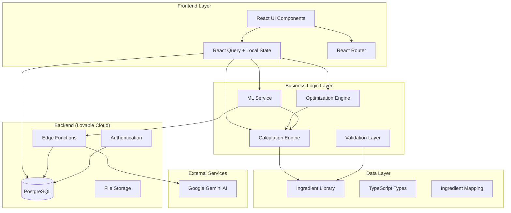
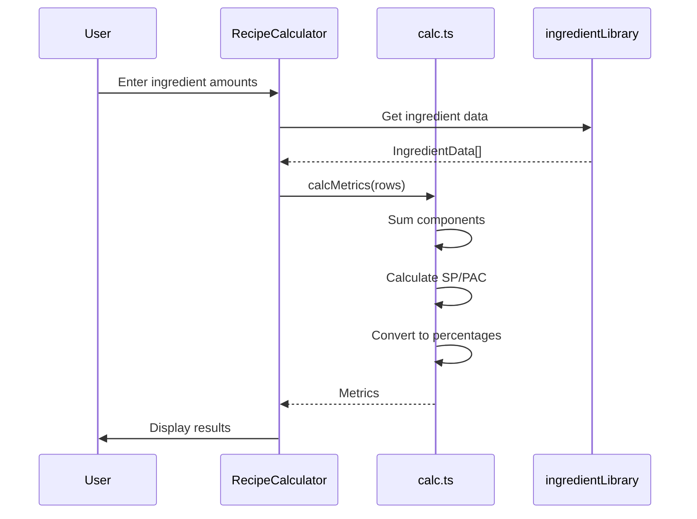
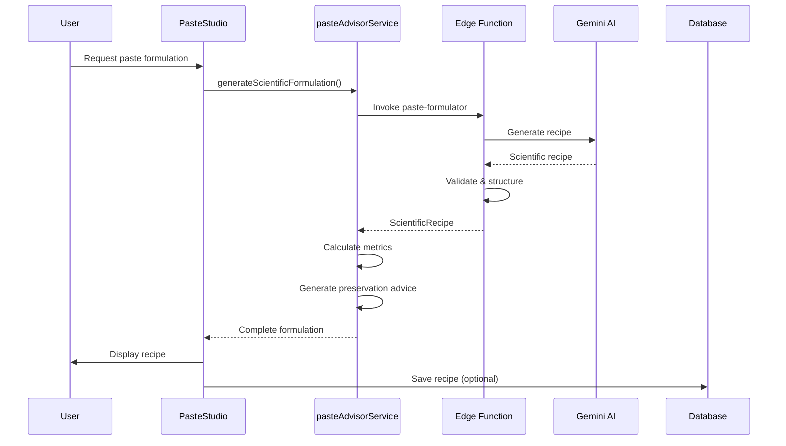

# MeethaPitara Calculator - Architecture Documentation

## System Architecture Overview



## Component Architecture

### Layer 1: Presentation Components

```
src/components/
├── RecipeCalculator.tsx       # Main recipe calculator
├── FlavourEngine.tsx          # Multi-ingredient analyzer
├── PasteStudio.tsx            # AI-powered paste formulator
├── ReverseEngineer.tsx        # Target-based recipe generator
├── CostCalculator.tsx         # Batch costing tool
├── UnitConverter.tsx          # Unit conversion utility
├── MachineSelector.tsx        # Equipment recommendations
├── BatchQA.tsx                # Quality assurance checklist
├── DatabaseManager.tsx        # Recipe CRUD operations
└── CalculationDebugger.tsx    # Development debugging tool
```

**Responsibilities:**
- User interaction and input handling
- State management (local component state)
- Display formatted data
- Error messaging
- Loading states

**Design Patterns:**
- Container/Presenter pattern
- Controlled components
- Composition over inheritance

### Layer 2: Specialized Sub-Components

```
src/components/flavour-engine/
├── IngredientAnalyzer.tsx     # Individual ingredient analysis
├── IngredientTable.tsx        # Tabular ingredient display
├── ChemistryAnalysis.tsx      # Chemical composition breakdown
├── ProductAnalysis.tsx        # Finished product metrics
├── AIInsights.tsx             # ML-powered insights
├── AIOptimization.tsx         # AI optimization suggestions
├── SugarBlendOptimizer.tsx    # Sugar type optimization
├── TargetPanel.tsx            # Target metric input
├── UnitConverterAdvanced.tsx  # Advanced conversions
└── utils.ts                   # Shared utility functions
```

**Responsibilities:**
- Focused, single-purpose components
- Reusable across multiple features
- Type-safe props interfaces
- Memoization for performance

### Layer 3: Business Logic

```
src/lib/
├── calc.ts                    # Core calculation engine
├── optimize.ts                # Recipe optimization algorithm
├── ingredientLibrary.ts       # Ingredient database
├── ingredientMapping.ts       # Type conversion & validation
├── params.ts                  # Product parameter calculations
├── autotune.ts                # Auto-tuning algorithms
└── scoopability.ts            # Texture analysis
```

**Key Functions:**

#### calc.ts
```typescript
export function calcMetrics(
  rows: { ing: IngredientData; grams: number }[],
  opts?: { evaporation_pct?: number }
): Metrics

// Returns:
// - grams: { total, water, sugars, fat, msnf, other }
// - pct: { water_pct, sugars_pct, fat_pct, msnf_pct, other_pct, ts_add_pct }
// - sp: Sweetness Power
// - pac: Anti-freezing Capacity
```

**Algorithm:**
1. Sum component weights (water, sugars, fat, protein, other)
2. Apply evaporation adjustment to water
3. Calculate MSNF (protein + lactose + other)
4. Calculate SP/PAC using sugar coefficients
5. Convert to percentages

#### optimize.ts
```typescript
export function optimizeRecipe(
  rowsIn: Row[],
  targets: OptimizeTarget,
  maxIters?: number,
  step?: number
): Row[]

// Hill-climbing algorithm:
// 1. Calculate current objective (deviation from targets)
// 2. For each ingredient, try +/- step adjustment
// 3. Accept if improves objective
// 4. Repeat until no improvement or maxIters
```

**Optimization Targets:**
- `ts_add_pct`: Total solids added
- `sugars_pct`: Sugar percentage
- `fat_pct`: Fat percentage
- `msnf_pct`: MSNF percentage
- `sp`: Sweetness power
- `pac`: Anti-freezing capacity

#### ingredientMapping.ts
```typescript
export function convertLegacyRecipeToRows(
  recipe: { [key: string]: number }
): Array<{ ing: IngredientData; grams: number }>

export function matchIngredientName(
  searchName: string
): IngredientData | null

export function validateIngredientData(
  ing: IngredientData
): { valid: boolean; warnings: string[] }
```

**Purpose:**
- Bridge between legacy and modern formats
- Fuzzy ingredient name matching
- Data integrity validation

### Layer 4: Service Layer

```
src/services/
├── mlService.ts               # ML integration & predictions
├── pasteAdvisorService.ts     # AI paste formulation
├── productParametersService.ts # Product spec calculations
├── databaseService.ts         # Database operations
└── pairingService.ts          # Flavor pairing recommendations
```

#### mlService.ts

**Key Methods:**

1. **predictRecipeSuccess()**
```typescript
predictRecipeSuccess(recipe: any): MLPrediction {
  // Analyze recipe and predict:
  // - Success score (0-100)
  // - Flavor profile
  // - Texture prediction
  // - Stability assessment
}
```

2. **calculateRecipeMetrics()**
```typescript
calculateRecipeMetrics(
  recipe: { rows: [...] } | { [key: string]: number }
): RecipeMetrics {
  // Convert to standard format
  // Calculate all metrics
  // Return normalized data
}
```

3. **optimizeRecipe()**
```typescript
optimizeRecipe(
  seed: Row[],
  targets: OptimizeTarget
): Row[] {
  // Wrapper around optimize.ts
  // Add ML-based suggestions
  // Return optimized recipe
}
```

4. **reverseEngineer()**
```typescript
reverseEngineer(input: {
  productType: 'ice_cream' | 'gelato_white' | ...;
  known?: Partial<{ fat_pct, sugars_pct, ... }>;
  palette: IngredientData[];
  totalMass?: number;
}): { rows: Row[]; metrics: Metrics } {
  // Calculate target metrics
  // Generate recipe from palette
  // Optimize to meet targets
}
```

#### pasteAdvisorService.ts

**Methods:**

1. **generateScientificFormulation()**
```typescript
async generateScientificFormulation(
  pasteType: string,
  category: string,
  mode: 'quick' | 'detailed',
  knownIngredients?: string[],
  constraints?: string
): Promise<ScientificRecipe>

// Calls edge function with Gemini AI
// Returns structured recipe with citations
```

2. **calculateScientificMetrics()**
```typescript
calculateScientificMetrics(
  formula: PasteFormula
): {
  metrics: { ts, fat, msnf, sugars, aw };
  benchmarks: { category, range };
  warnings: string[];
}

// Validates against industry standards
```

3. **advise()**
```typescript
advise(
  formula: PasteFormula,
  preferences?: { method, shelfLife }
): PreservationAdvice[]

// Analyzes formula
// Suggests preservation methods
// Rates by confidence
```

### Layer 5: Type System

```
src/types/
├── ingredients.ts             # Ingredient data structures
├── paste.ts                   # Paste formulation types
├── parameters.ts              # Product parameters
├── machine.ts                 # Equipment types
└── pairing.ts                 # Flavor pairing types
```

**Key Types:**

```typescript
// Core ingredient structure
interface IngredientData {
  id: string;
  name: string;
  water_g: number;
  sugars_g: number;
  fat_g: number;
  protein_g: number;
  other_solids_g: number;
  msnf_g: number;  // Calculated
  
  // Sugar breakdown
  sucrose_pct?: number;
  dextrose_pct?: number;
  fructose_pct?: number;
  lactose_pct?: number;
  maltose_pct?: number;
  maltodextrin_pct?: number;
  trehalose_pct?: number;
  inulin_pct?: number;
  
  // Metadata
  category?: string;
  cost_per_kg?: number;
  density_g_ml?: number;
}

// Calculation result
interface Metrics {
  grams: {
    total: number;
    water: number;
    sugars: number;
    fat: number;
    msnf: number;
    other: number;
  };
  pct: {
    water_pct: number;
    sugars_pct: number;
    fat_pct: number;
    msnf_pct: number;
    other_pct: number;
    ts_add_pct: number;
  };
  sp: number;
  pac: number;
}

// Recipe row
interface Row {
  ing: IngredientData;
  grams: number;
  lock?: boolean;
  min?: number;
  max?: number;
}

// Scientific paste recipe
interface ScientificRecipe {
  title: string;
  pasteType: string;
  category: string;
  ingredients: ScientificIngredient[];
  process: ProcessStep[];
  preservation: PreservationAdvice[];
  yield: { amount: number; unit: string };
  notes: string[];
  composition: {
    totalSolids: number;
    sugars: number;
    fat?: number;
    msnf?: number;
  };
  sensory: SensoryPrediction;
  costEstimate?: { value: number; unit: string };
  references: Reference[];
}
```

## Data Flow Architecture

### Recipe Calculation Flow



### Optimization Flow

```mermaid
sequenceDiagram
    participant User
    participant UI as FlavourEngine
    participant Opt as optimize.ts
    participant Calc as calc.ts
    
    User->>UI: Set targets
    UI->>Opt: optimizeRecipe(rows, targets)
    loop maxIters or converged
        Opt->>Opt: Try ingredient adjustments
        Opt->>Calc: calcMetrics(test)
        Calc-->>Opt: Metrics
        Opt->>Opt: Calculate objective
        Opt->>Opt: Accept if improved
    end
    Opt-->>UI: Optimized rows
    UI->>User: Display optimized recipe
```

### AI Paste Formulation Flow



### Reverse Engineering Flow

```mermaid
sequenceDiagram
    participant User
    participant UI as ReverseEngineer
    participant ML as mlService
    participant Params as productParametersService
    participant Opt as optimize.ts
    
    User->>UI: Select product type & palette
    UI->>Params: Get target metrics
    Params-->>UI: Target ranges
    User->>UI: Specify known metrics
    UI->>ML: reverseEngineer(input)
    ML->>ML: Calculate full targets
    ML->>ML: Initialize recipe
    ML->>Opt: optimizeRecipe(seed, targets)
    Opt-->>ML: Optimized recipe
    ML->>ML: Calculate final metrics
    ML-->>UI: Recipe + metrics
    UI->>User: Display recipe
```

## State Management Architecture

### Component State Strategy

```typescript
// Local state for UI-only concerns
const [expanded, setExpanded] = useState(false);
const [selectedTab, setSelectedTab] = useState('calculator');

// Derived state from props/calculations
const metrics = useMemo(() => calcMetrics(recipe), [recipe]);

// Server state via React Query
const { data: savedRecipes } = useQuery({
  queryKey: ['recipes'],
  queryFn: fetchRecipes
});
```

### State Flow Patterns

1. **Unidirectional Data Flow**
```
User Input → State Update → Calculation → UI Update
```

2. **Memoization for Performance**
```typescript
const expensiveResult = useMemo(() => {
  return complexCalculation(inputs);
}, [inputs]);
```

3. **Debouncing User Input**
```typescript
const debouncedUpdate = useMemo(
  () => debounce((value) => updateState(value), 300),
  []
);
```

## Backend Architecture (Lovable Cloud)

### Edge Functions

```
supabase/functions/
└── paste-formulator/
    └── index.ts               # AI formulation endpoint
```

**Function: paste-formulator**

```typescript
serve(async (req) => {
  const { pasteType, category, mode, knownIngredients, constraints } = await req.json();
  
  // 1. Build AI prompt
  const prompt = buildScientificPrompt(pasteType, category, ...);
  
  // 2. Call Gemini AI
  const response = await generateContent(prompt);
  
  // 3. Parse & validate response
  const recipe = parseScientificRecipe(response);
  
  // 4. Return structured data
  return new Response(JSON.stringify(recipe), {
    headers: { 'Content-Type': 'application/json' }
  });
});
```

**Security:**
- CORS enabled for frontend
- Rate limiting (automatic)
- Input validation
- Error handling with fallbacks

### Database Schema

```sql
-- Recipes table (ready for user auth)
CREATE TABLE recipes (
  id UUID PRIMARY KEY DEFAULT gen_random_uuid(),
  user_id UUID REFERENCES auth.users,
  name TEXT NOT NULL,
  ingredients JSONB NOT NULL,
  metrics JSONB,
  created_at TIMESTAMPTZ DEFAULT NOW(),
  updated_at TIMESTAMPTZ DEFAULT NOW()
);

-- Profiles table (ready for user auth)
CREATE TABLE profiles (
  id UUID PRIMARY KEY REFERENCES auth.users,
  display_name TEXT,
  preferences JSONB,
  created_at TIMESTAMPTZ DEFAULT NOW()
);

-- Row Level Security (when auth enabled)
ALTER TABLE recipes ENABLE ROW LEVEL SECURITY;

CREATE POLICY "Users can view own recipes"
  ON recipes FOR SELECT
  USING (auth.uid() = user_id);
```

## Performance Architecture

### Optimization Strategies

1. **Code Splitting**
```typescript
const PasteStudio = lazy(() => import('./components/PasteStudio'));
const ReverseEngineer = lazy(() => import('./components/ReverseEngineer'));
```

2. **Memoization**
```typescript
const MetricsDisplay = memo(({ metrics }) => {
  // Only re-render when metrics change
});
```

3. **Debouncing**
```typescript
const debouncedCalculate = useCallback(
  debounce((recipe) => setMetrics(calcMetrics(recipe)), 300),
  []
);
```

4. **Virtual Scrolling** (for large lists)
```typescript
import { FixedSizeList } from 'react-window';

<FixedSizeList
  height={400}
  itemCount={ingredients.length}
  itemSize={60}
>
  {IngredientRow}
</FixedSizeList>
```

### Performance Metrics

- **Initial Load**: < 2s
- **Calculation**: < 10ms for complex recipes
- **Optimization**: < 500ms for 200 iterations
- **AI Generation**: 3-8s depending on mode
- **Bundle Size**: ~800KB (gzipped)

## Security Architecture

### Input Validation

```typescript
// Sanitize numeric inputs
const sanitizeAmount = (input: string): number => {
  const num = parseFloat(input);
  return isNaN(num) ? 0 : Math.max(0, Math.min(10000, num));
};

// Validate ingredient data
const { valid, warnings } = validateIngredientData(ingredient);
if (!valid) {
  throw new Error('Invalid ingredient data');
}
```

### API Security

- **Edge Functions**: Automatic CORS and rate limiting
- **RLS Policies**: Database-level access control
- **Auth**: Supabase Auth ready (not enforced)
- **Input Sanitization**: React automatic XSS protection

### Error Handling

```typescript
try {
  const recipe = await generatePaste(input);
} catch (error) {
  console.error('Generation failed:', error);
  toast({
    title: 'Error',
    description: 'Failed to generate paste. Please try again.',
    variant: 'destructive'
  });
  // Fallback to default recipe
}
```

## Deployment Architecture

### Build Process

```bash
# 1. Type checking
tsc --noEmit

# 2. Build
vite build
# Output: dist/ folder

# 3. Deploy
# Auto-deploy via Lovable Cloud
# Or manual deploy to Vercel/Netlify
```

### Environment Configuration

**Auto-configured by Lovable Cloud:**
- `VITE_SUPABASE_URL`
- `VITE_SUPABASE_PUBLISHABLE_KEY`
- `VITE_SUPABASE_PROJECT_ID`

**No manual .env setup required!**

### Hosting Options

1. **Lovable Cloud** (default)
   - Auto-deploy on push
   - Integrated backend
   - Zero config

2. **Vercel**
   - Optimized for Vite
   - Edge functions support
   - Custom domains

3. **Netlify**
   - Simple deployment
   - Build previews
   - Form handling

## Testing Architecture

### Testing Strategy

```typescript
// Unit tests (recommended)
describe('calcMetrics', () => {
  it('should calculate metrics correctly', () => {
    const recipe = [
      { ing: milk, grams: 500 },
      { ing: sugar, grams: 100 }
    ];
    const metrics = calcMetrics(recipe);
    expect(metrics.sugars_pct).toBeCloseTo(16.67, 2);
  });
});

// Integration tests
describe('Optimization', () => {
  it('should optimize to targets', () => {
    const result = optimizeRecipe(seed, { fat_pct: 8 });
    const metrics = calcMetrics(result);
    expect(metrics.fat_pct).toBeCloseTo(8, 0.5);
  });
});

// E2E tests (Playwright)
test('should generate paste recipe', async ({ page }) => {
  await page.goto('/');
  await page.click('text=Paste Studio');
  await page.fill('[placeholder="Paste name"]', 'Strawberry');
  await page.click('text=Generate');
  await expect(page.locator('.recipe-result')).toBeVisible();
});
```

## Monitoring & Debugging

### Built-in Tools

1. **Calculation Debugger**
```typescript
<CalculationDebugger recipe={recipe} />
// Shows detailed breakdown of all calculations
```

2. **Console Logging**
```typescript
console.log('Metrics:', metrics);
console.warn('Sugar breakdown missing for:', ingredient.name);
```

3. **Error Boundaries**
```typescript
<ErrorBoundary>
  <App />
</ErrorBoundary>
```

### Production Monitoring

- **Error Tracking**: Browser console (or integrate Sentry)
- **Performance**: Lighthouse CI
- **Edge Functions**: Supabase logs
- **Database**: Query performance analyzer

## Scalability Considerations

### Current Capacity
- **Users**: Supports 100+ concurrent users
- **Recipes**: Unlimited storage
- **AI Calls**: Rate-limited by Lovable Cloud
- **Database**: Supabase free tier (500MB)

### Scale-Up Strategies

1. **Frontend**
   - CDN caching
   - Service worker for offline
   - Progressive Web App

2. **Backend**
   - Connection pooling
   - Query optimization
   - Caching layer (Redis)

3. **AI**
   - Response caching
   - Queue system for batch processing
   - Fallback to simpler models

## Future Architecture Enhancements

### Recommended Improvements

1. **Micro-Frontend Architecture**
   - Split calculators into separate bundles
   - Lazy load on demand
   - Independent deployment

2. **Event-Driven Architecture**
   - Recipe change events
   - Calculation pipeline
   - Async optimization

3. **GraphQL API**
   - Replace REST with GraphQL
   - Better type safety
   - Efficient data fetching

4. **WebAssembly**
   - Compile optimization to WASM
   - Faster calculations
   - Better performance

---

**Document Version**: 1.0  
**Last Updated**: 2025-01-01  
**Maintained By**: MeethaPitara Team
